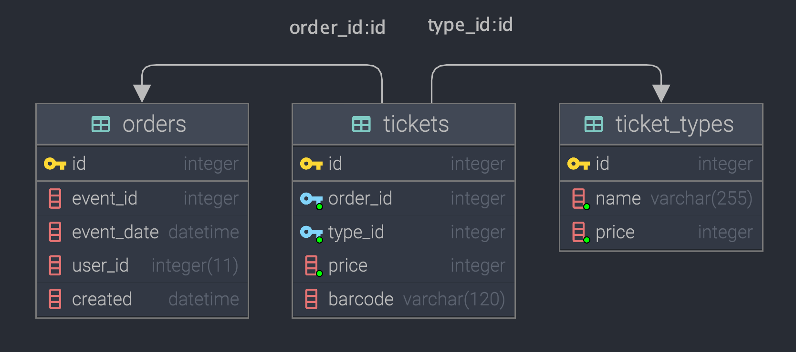

Вариант исполнения тестового задания.

# Задание 1

## Сервис обработки заказов

### Описание
Сервис обработки заказов основан на компонентах [Symfony](https://symfony.com/). Используется пакеты: внедрения зависимостей, консоли cli, dbal и пр. Настройка переменных окружения осуществляется средствами `.env`. В реализации используется база данных `sqlite`. Вызов API осуществляется методами имитаторами. Оценка работы сервиса реализована через `phpunit` тесты.

### Основной принцип работы
Подразумевается, что на вход контроллера `OrderProcessingController` (в тексте задания определен как функция) подается объект класса `Order`, содержащий в свойствах переменные определенные тестовым заданием, а именно `event_id`, `event_date`, `ticket_adult_price`, `ticket_adult_quantity`, `ticket_kid_price`, `ticket_kid_quantity`. В рамках цикла осуществляется: 
- генерация уникального баркода с проверкой его уникальности в базе данных сервиса через предсохранение заказа,
- обращение к API с запросом брони с проверкой ответа на наличие ошибок бронирования,
- если баркод уникален в рамках базы и получено подтверждение брони, выполняется запрос на подтверждение брони,
- если в одном из случаев определяется факт не уникальности баркода или ошибки бронирования и количество попыток определенное значением `ATTEMPTS_COUNT_TO_CALL_THE_API` не исчерпано, выполняется повторное его генерирование,
- при отсутствии ошибок бронирования выполняется запрос на подтверждение брони,
- если бронь подтверждена успешно, ранее предсохраненный заказ подтверждается через установку значения поля `created`,
- если бронь не подтверждена, предсохраненный заказ удаляется из базы данных сервиса.

### Важные замечания
Класс `OrderProcessingController`, как и прочие сущесвенные с т.з. сервиса классы, содержит исчерпывающие комментарии по своей структуре. Метод обработчик формирует и возвращает переменную массив - отчет о выполненных шагах. Дамп отчета можно использовать для более подробного анализа работы сервиса.

Сервис содержит консольное приложение `./cli`, при необходимости его можно использовать для расширенного тестирования сервиса средствами cli. Для запуска и получения перечня доступных команд выполнить в консоли:
```bash
sudo chmod +x ./cli
./cli
```

### Установка
Для установки приложения необходимо выполнить следующую последовательность команд в консоли.
```bash
git clone git@github.com:skodnik/nt_test_task_v2.git
cd nt_test_task_v2
cp .env.example .env
composer install
```

### Оценка работоспособности сервиса
Вызов `__invoke` метода `OrderProcessingController` контроллера осуществляется средствами функциональных тестов реализованных с помощью пакета `phpunit/phpunit`. В рамках тестирования выполняется:
1. инициализация таблиц базы данных: `users` и `orders`, предварительное их наполнение данными из тестового задания,
2. проверка получения полного перечня пользователей и заказов из базы данных сервиса,
3. проверка формирования баркода и его содержания,
4. проверка успешного создания заказа,
5. проверка предсохранения заказа в базе данных сервиса,
6. проверка корректной обработки ошибки сохранения заказа с существующим баркодом,
7. проверка подтверждения заказа в базе данных,
8. проверка алгоритма обработки заказа контроллером.

Для запуска тестов необходимо выполнить в консоли.
```bash
./vendor/bin/phpunit
```

Пример вывода результата:
```bash
PHPUnit 9.5.10 by Sebastian Bergmann and contributors.

Runtime:       PHP 8.0.10
Configuration: /Users/vlsv/PhpStormProjects/_tmp/nevatrip_2/phpunit.xml

Service
 ✔ Get all users  3 ms
 ✔ Get all orders  1 ms
 ✔ Get new barcode  1 ms
 ✔ Make order  1 ms
 ✔ Store order  1 ms
 ✔ Store order with not unique barcode exception  3 ms
 ✔ Confirm order  1 ms
 ✔ Order processing controller  2 ms

Time: 00:00.018, Memory: 6.00 MB

OK (8 tests, 12 assertions)

```

## Задание 2
1. Для реализации возможности добавления иных, неопределенных в настоящее время типов билетов, наиболее целесообразно изменить существующую структуру таблицы `orders` исключив столбцы `ticket_adult_price`, `ticket_adult_quantity`, `ticket_kid_price`, `ticket_kid_quantity`, ``equal_price`` и создать таблицы `ticket_types` содержащую идентификатор, именования типов и цену и `tickets` содержащую идентификатор, тип билета и идентификатор заказа как внешний ключ.
2. В дополнение к пункту 1, из таблицы `orders` необходимо перенести поле `barcode` в таблицу `tickets`.

Предлагаемые изменения позволят добавлять новые типы билетов без необходимости корректировки структуры базы данных сервиса. Перенос поля `barcode` в таблицу `tickets` позволит разделить билеты в рамках заказа. Значение финальной стоимости целесообразнее формировать как сумму билетов умноженную на их стоимость в рамках выбранного заказа, а не хранить как статическое значение в базе данных.


### Итоговая структура таблиц



```mysql
CREATE TABLE orders
(
    id INTEGER PRIMARY KEY,
    event_id INTEGER,
    event_date DATETIME,
    user_id INTEGER(11),
    equal_price INTEGER(11),
    created DATETIME DEFAULT NULL
);
```

```mysql
CREATE TABLE tickets
(
    id INTEGER PRIMARY KEY,
    order_id INTEGER NOT NULL,
    type_id INTEGER NOT NULL,
    price INTEGER NOT NULL,
    barcode VARCHAR(120),
    FOREIGN KEY(order_id) REFERENCES orders(id),
    FOREIGN KEY(type_id) REFERENCES ticket_types(id)
);
```

```mysql
CREATE TABLE  ticket_types
(
    id INTEGER PRIMARY KEY,
    name VARCHAR(255) NOT NULL,
    price INTEGER NOT NULL
);
```